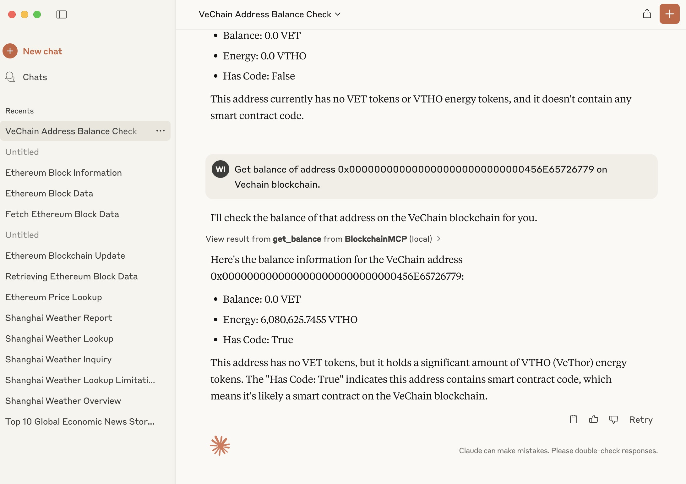

# AI MCP Server of Blockchain

#### Functions

* get balance of address
* get transaction content by transaction Id or transaction hash
* get block content by block number, block hash
  More feature will come....

#### Blockchain

- Ethereum, VeChain.

- *Bitcoin, Solana, Polygon will come soon.*

#### Setup

1. Install dependencies using uv

```bash
$uv venv
$uv sync
```

2. Create a .env file with your blockchain API key:

   ```
   export ETHEREUM_NODE_URL=<your-ethereum-url>
   export VECHAIN_NODE_URL=<your-vechain-url>
   ```

#### Running the Server Config

```
{
    "mcpServers": {
        "blockchain": {
            "command": "uv",
            "args": ["--from", "/your/blockchain/mcp/path/", "blockchain-mcp"],
            "env": {
  		"ETHEREUM_NODE_URL":"https://mainnet.infura.io/v3/<your_key>",
		"VECHAIN_NODE_URL":"https://<vechain-node-url>"
            }
        }
    }
}
```

#### Debug MCP Server

```bash
$source .env
$npx @modelcontextprotocol/inspector uv --directory /path/to/blockchain-mcp run blockchain-mcp
```


#### Integrated with AI Claude Desktop App

1. Add Configure file
2. Try it on Claude desktop App



