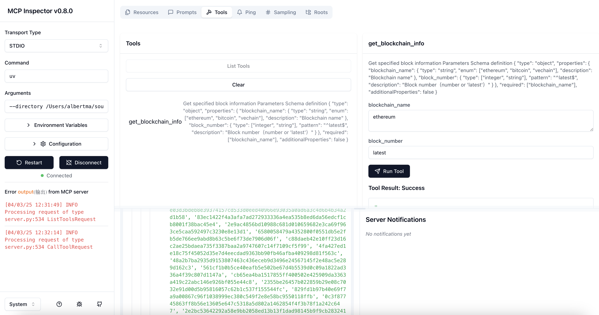
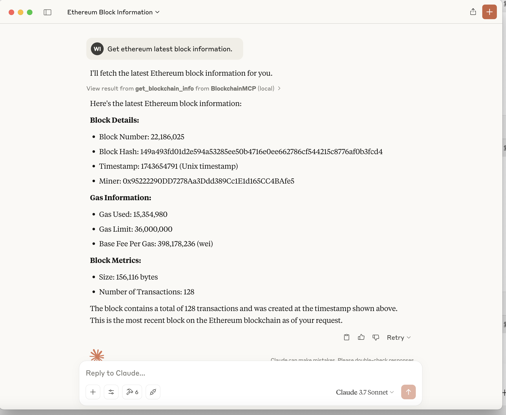

# AI MCP Server of Blockchain

#### Setup

1. Install dependencies using uv

```
uv venv
uv sync
```

2. Create a .env file with your blockchain API key:

   ```
   ETHEREUM_NODE_URL=<your-ethereum-url>
   VECHAIN_NODE_URL=<your-vechain-url>
   ```

#### Running the Server Config

```
{
    "mcpServers": {
        "blockchain": {
            "command": "uv",
            "args": ["--from", "/your/blockchain/mcp/path/", "blockchain-mcp"],
            "env": {
  
            }
        }
    }
}
```

#### Debug MCP Server

```
npx @modelcontextprotocol/inspector
uv
--directory /path/to/blockchain-mcp
run
blockchain-mcp
```



#### Integrated with Claude Desktop App

1. Add Configure file
2. Try it on Desktop


